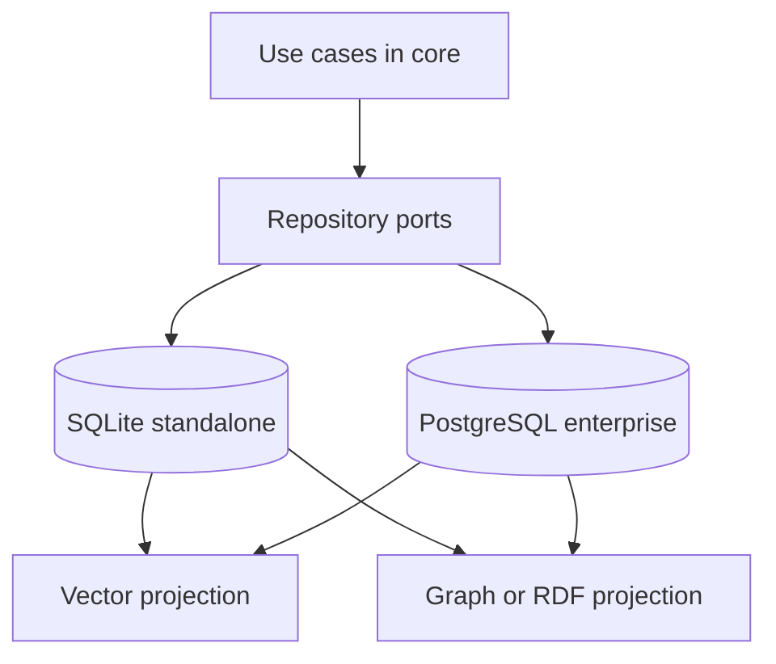

# 2. Canonical SQL source of truth

Date: 2026-08-18

## Status

Accepted

## Context

Brainledge must be useful on a laptop with no extra infrastructure and also correct for multi-user enterprise deployments. Graph databases, RDF stores, and vector indexes are attractive for neighborhood queries and similarity search, but requiring any of them as the system of record would kill standalone mode and split the domain model.

Reference systems split truth across backends (Neo4j, RDF graphs, vector DBs). That produces serving gaps: the product claims a knowledge graph while the only durable store is something else, or the local path cannot boot.

## Decision

SQL is the canonical source of truth for Brainledge knowledge, identity, jobs, and audit metadata.

- Standalone persists with SQLite via `node:sqlite` `DatabaseSync`.
- Enterprise persists with PostgreSQL through the same repository ports.
- Lexical search is FTS (SQLite FTS5, PostgreSQL FTS).
- Vector embeddings may be stored in SQL and queried with exact cosine at documented scale; they are a projection.
- Graph neighborhood queries run over SQL first. LPG and RDF/SPARQL stores, if added, implement projection ports and never become the system of record.

Both engines share one `describeStorageAdapter` contract suite.

## Consequences

Standalone boots with one file and no native addons. Enterprise can scale the same schema on PostgreSQL. Specialized stores stay optional adapters (Phase 7). The cost is that some graph/SPARQL workloads will be slower until a projection is configured; that is acceptable because those adapters are not required to recall memories or enforce workspace isolation.
