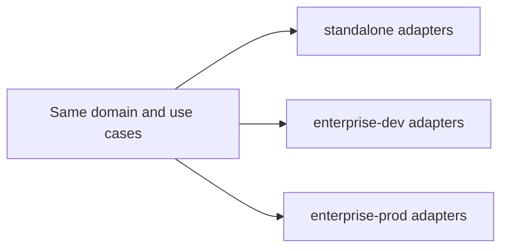

# 3. Standalone and enterprise profiles

Date: 2026-08-18

## Status

Accepted

## Context

Individuals will not run Docker, PostgreSQL, or an identity provider to store notes. Enterprises will not accept an implicit local user as the isolation model. Shipping two products (or `if (enterpriseMode)` domain forks) recreates the Semantica-style split between library and serving path.

Configuration must not infer “enterprise” from a database URL; that silently changes security posture.

## Decision

One codebase, three deployment profiles of the **same contracts**:

- **standalone** — one Node process, implicit `local-user` / `local` / `personal` space, SQLite + local blobs, loopback bind, optional local API token, stdio MCP.
- **enterprise-dev** — Compose (app + worker + Postgres), optional auth and object-storage profiles, isolation e2e.
- **enterprise-prod** — API and worker processes, PostgreSQL, OIDC, object storage, durable workers, audit, OpenTelemetry.

Profile is explicit: `APP_PROFILE=standalone|enterprise` and `profile` in `config.json`. Never infer enterprise from a URL.

Domain logic does not branch on profile. Adapters do.

## Consequences

Standalone remains pleasant (no Docker, no login). Enterprise can add OIDC and Postgres without rewriting `remember` / `recall`. Operators must set the profile explicitly. Features that need enterprise adapters (OIDC, grants, isolation e2e) are sequenced to Phase 3, not dumped into the walking skeleton.
