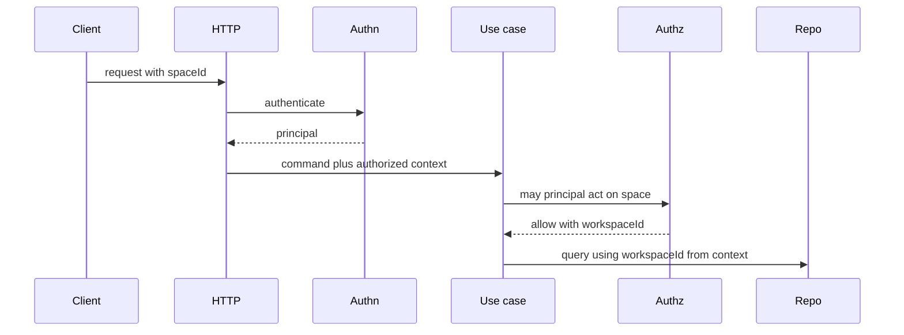

# 4. Workspace authorization boundary

Date: 2026-08-18

## Status

Accepted

## Context

TrustGraph’s useful lesson is an explicit workspace boundary and a split between authentication and authorization. Its failure mode for this product is treating a caller-supplied tenant id as isolation. Three-level tenancy (Organization → Workspace → KnowledgeSpace) is correct for enterprise and toxic if it leaks into standalone UX.

HTTP authentication answers “who is this caller?” Persistence must still refuse unscoped reads as defense in depth.

## Decision

The **workspace** is the authorization isolation boundary.

- Every durable object carries `workspaceId`.
- Every repository method takes `workspaceId` from **authorized context**, not from the client body alone.
- HTTP authenticates; use cases authorize.
- Knowledge spaces are the user-facing `space`. Standalone auto-creates `local` / `personal` / default space and hides org/workspace in APIs until enterprise UI exists.
- Private spaces are not visible to workspace admins unless policy allows.
- Enterprise maps OIDC subject → Principal and does not map authorization from arbitrary claims.

## Consequences

Cross-workspace leakage becomes a contract-test failure rather than an HTTP-layer hope. Standalone users never see org admin. Implementers cannot add a repository method that omits `workspaceId` without failing architecture guards. RLS (P2-002) may later add defense in depth; it does not replace application authorization.
