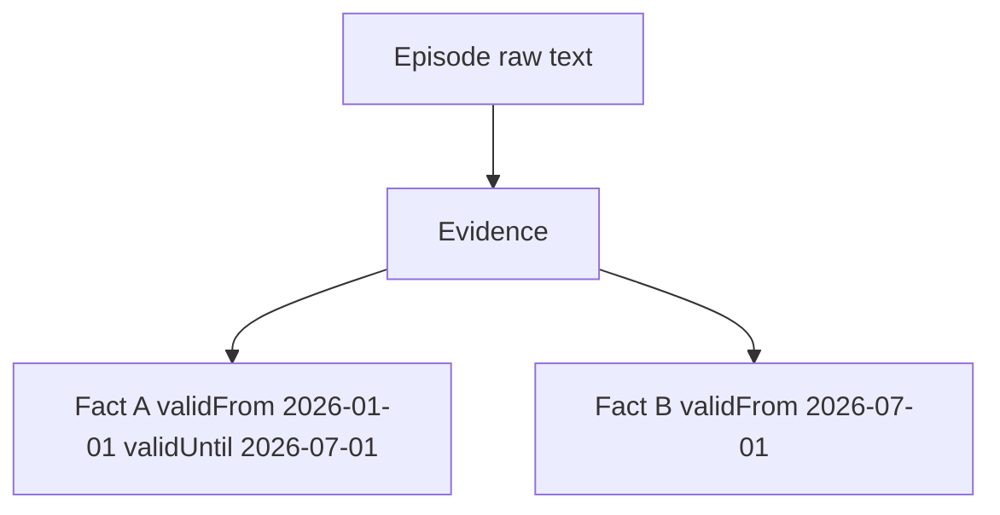

# 5. Temporal typed-triple fact model

Date: 2026-08-18

## Status

Accepted

## Context

The original RFC mixed an RDF-style `Fact` (`subject` / `predicate` / `object`) with Graphiti-style time fields, but never defined `FactValue` or `EntityRef`. Dual-coding retraction as both `status: 'retracted'` and `retractedAt` allows those fields to disagree. Natural-language memory (`remember`) is not a typed triple; pretending P0 recall extracts `livesIn` overclaims semantics.

A Graphiti-like “fact text + two entity ids” model would postpone ontology and RDF export. Keeping both NL facts and triples as first-class stores would double the surface.

## Decision

A canonical fact is a **typed temporal triple**:

- `subject`: `EntityRef`
- `predicate`: `PredicateRef`
- `object`: `EntityRef | LiteralValue` (as `FactObject`)
- envelope: `validFrom` / `validUntil` (world time) and `assertedAt` / `retractedAt` (system time)

Raw text lives on `Episode`. Extraction is a later pipeline, not `remember()`.

**Retraction:** `retractedAt` is the source of truth. `status === 'retracted'` iff `retractedAt` is set. `status: 'disputed'` is explicit and is not derived from timestamps.

History is appended. Supersession sets `validUntil` / `retractedAt`; it does not delete rows. Contradictory facts may share subject+predicate with overlapping validity.

## Consequences

P0 recall is lexical over episodes and does not require a triple store table. Phase 4 can add `facts` tables additively. RDF export (Phase 5) projects these triples; RDF types never leak into the memory facade. Implementers must keep Clock and UnitOfWork ports so “as of T” and rollback tests are possible.
