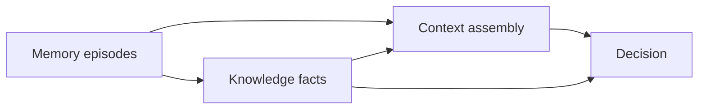

# 6. Memory vs knowledge vs context vs decision

Date: 2026-08-18

## Status

Accepted

## Context

Cognee’s `remember` / `recall` / `forget` facade is the right individual DX. Semantica’s decisions and provenance are the right enterprise DX. If those words collapse into one “memory object,” retrieval, deletion, and audit become undefined: hiding a note is not the same as retracting a fact or purging embeddings.

Agents also need a situation-specific slice of the store (context) that is not itself durable knowledge.

## Decision

Use four distinct concepts:

- **Memory** — an observation retained by the system (episode/note/document/tool result). Facade: `remember`, `recall`, `forget`.
- **Knowledge** — durable typed temporal facts and entities, optionally ontology-validated. Low-level APIs: `queryFacts`, `queryEntities`, `findContradictions`.
- **Context** — a task-specific selection of memories, facts, policies, and prior decisions. Usually ephemeral; a snapshot may be persisted for audit.
- **Decision** — a durable action or recommendation with structured evidence, policies, and facts — not only free-form LLM text.

Provenance is a graph over `source → episode → extraction → fact → inference → context → decision`.

P0 `forget` modes are `hide` and `delete`. `retract` and `purge` apply to knowledge and derived artifacts later.

## Consequences

The walking skeleton can ship a useful memory facade without extraction. Later phases fill knowledge without changing `remember`’s write path. UI and MCP risk profiles can grant `memory-read` without `knowledge-admin`. The cost is more types; that is cheaper than one overloaded “memory” table.
