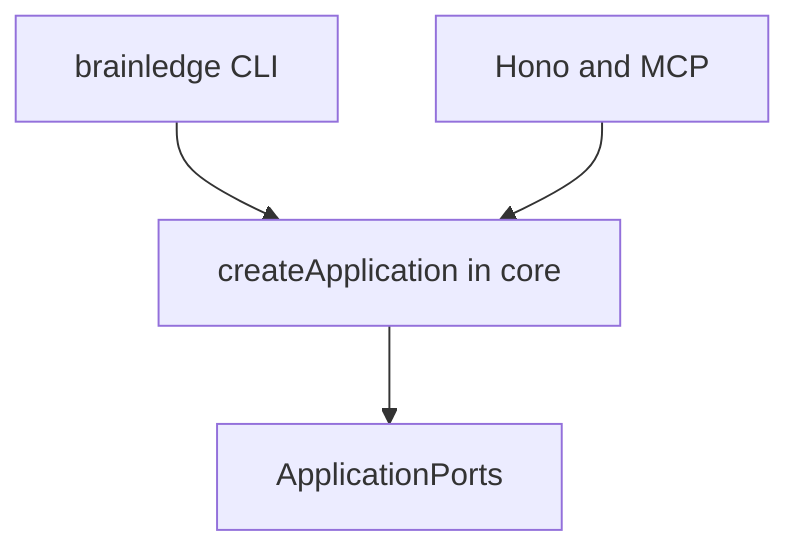

# 7. Composition root without plugin runtime in P0

Date: 2026-08-18

## Status

Accepted

## Context

The original RFC put application composition in `@brainledge/server` while saying the CLI “calls core directly.” That duplicates wiring and invites hidden global registries. A plugin runtime in P0 (manifests, API versions, sandboxing) would delay the walking skeleton and create a supply-chain surface before the product can remember a note.

Magic DI frameworks conflict with “no implicit dependency injection” and with in-process tests.

## Decision

`createApplication(ports: ApplicationPorts): Application` lives in `@brainledge/core`.

CLI and server construct adapters (SQLite or later Postgres, Clock, Authorizer, JobQueue, BlobStore, optional model providers) and pass them in. No global registry. No plugin loader in P0/Phase 1.

Plugin manifests and `createApplication({ plugins })` with `apiVersion` checks arrive in Phase 5. Plugins receive capability-scoped ports, never a raw database handle.

## Consequences

One composition path for REST, MCP, and CLI. Tests inject Nullables without `vi.mock`. Phase 1 stays small. Later plugins cannot appear by dropping a file into a directory; they must be compiled in and version-checked. Third-party runtime plugins inside the enterprise process remain a non-goal.
