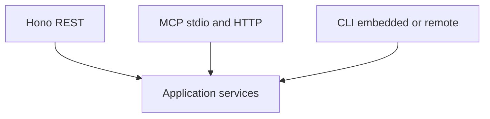

# 8. REST and MCP share application services

Date: 2026-08-18

## Status

Accepted

## Context

Coding agents will use MCP; humans and automation will use REST and the CLI. If each transport implements remember/recall/authz itself, tool catalogs drift, authorization is skipped on one path, and OpenAPI/MCP schemas disagree. That split is the historic Semantica lesson: a UI or protocol that does not call the same application services as the library.

## Decision

REST (Hono) and MCP (stdio now, Streamable HTTP later) are transports over the **same** `createApplication` use cases.

- MCP tools map 1:1 to platform actions (Phase 6 completes the mapping).
- Risk profiles (`memory-read`, `knowledge-read`, …) select which tools are exposed; they do not implement a second authorizer.
- Payloads separate trusted platform metadata from untrusted source content.
- Loopback HTTP MCP uses the same bind policy as REST. Remote HTTP MCP (Phase 6) uses the same OIDC resource server as REST.

The CLI in embedded mode also calls `createApplication`. `--server` calls REST rather than reimplementing use cases.

## Consequences

Authorization, workspace scoping, and forget semantics cannot diverge by protocol. OpenAPI and MCP catalogs can be generated from shared Zod/action metadata. Extra protocol-specific code is limited to transport, serialization, and risk-profile filtering.
