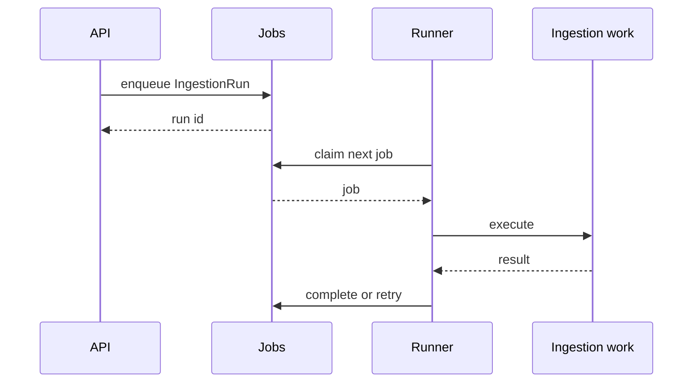

# 9. Durable job execution model

Date: 2026-08-18

## Status

Accepted

## Context

Ingestion, extraction, embeddings, and consolidate are too slow or too failure-prone to run only in the HTTP request. A required message broker would violate standalone-first. An in-memory queue loses work on crash. Remember must stay synchronous so the walking-skeleton e2e does not depend on a worker.

## Decision

Jobs are a domain port (`JobQueue`) with durable `jobs` and `job_attempts` tables.

- Claim is transactional. Retry is recorded. A crash does not silently drop an enqueued ingestion.
- **Phase 1:** tables exist; the in-process runner may claim zero job types.
- **Phase 2:** SQLite in-process runner executes ingestion and other expensive work. `remember` remains synchronous.
- **Phase 3/6:** PostgreSQL workers using `SKIP LOCKED` and an outbox **before** any broker.
- **Phase 7:** optional Cloud Tasks / Pub/Sub / SQS adapters. Core stays broker-agnostic.

Do not copy unrestricted bearer tokens into job payloads; persist principal ids and scoped grants (Phase 6 delegation).

## Consequences

Standalone survives process restart without Kafka. Enterprise can move the same job records onto Postgres workers. The skeleton is not blocked on a real runner, but contract tests still require the tables. Brokers remain optional; they must not become the source of truth for job state.
