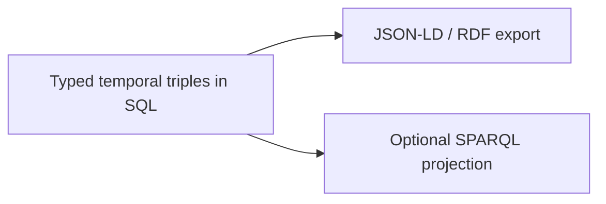

# 10. RDF interoperability boundary

Date: 2026-08-18

## Status

Accepted

## Context

Semantica’s ontology, SHACL, and RDF direction is valuable for interchange and formal validation. Making RDF types the memory API would force every `remember` caller to speak IRIs and literals, contradict Cognee-like DX, and require an RDF database that standalone users do not have.

JSON-LD export and SPARQL are real needs for some enterprises; they are not day-one product behavior.

## Decision

RDF is an **interoperability boundary**, not the canonical model.

- Domain types are TypeScript (`Fact`, `EntityRef`, `LiteralValue`).
- Phase 5: RDF/JSON-LD **export** of entities, facts, and evidence. Memory facade types stay unchanged.
- Phase 5: SHACL-compatible validation spike (separate ADR if the spike chooses a library).
- Phase 7: optional SPARQL projection backend (P2-003). SQL remains the system of record.

No RDF types on `remember` / `recall` / `forget`.

## Consequences

Ontology work can proceed without blocking the walking skeleton. Importers must map RDF into domain types rather than storing quads as truth. Teams that need a triple store can attach P2-003 without forking core. Full OWL reasoning stays demand-shaped and fixture-limited (P2-006), matching the RFC non-goal of “every OWL profile.”
