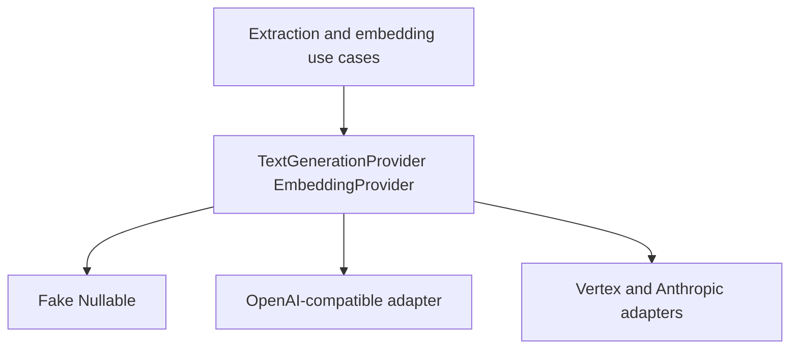

# 11. Model-provider abstraction

Date: 2026-08-18

## Status

Accepted

## Context

Extraction, embeddings, rerank, and completion need language models, but Brainledge must recall notes with no API key. Vendor SDKs in `core` would violate the import guard and couple the domain to OpenAI, Vertex, or Anthropic. Tests that `vi.mock` those SDKs would assert call shapes instead of behavior.

Local models (Ollama and other OpenAI-compatible servers) should work through the same port as hosted OpenAI.

## Decision

Model access is two ports in core: `TextGenerationProvider` and `EmbeddingProvider` (timeout, cancellation, retry classification, usage metadata).

- Tests use Fake/Nullable adapters. No `vi.mock` for these ports.
- Phase 1: Nullables that return empty embeddings / refuse generation.
- Phase 2: one **OpenAI-compatible** HTTP adapter covering OpenAI, OpenRouter, and local/Ollama-compatible URLs. Embeddings may be stored in SQL; vector search can be disabled.
- Phase 6: dedicated Vertex AI and Anthropic adapters on the **same** ports.
- Offline: `remember`, lexical `recall`, and `forget` remain usable with no provider configured.

`core` must not import vendor LLM SDKs. Adapters live outside `core`.

## Consequences

The skeleton e2e never needs a network. Adding a provider is a new adapter file, not a domain change. Cost and rate limits stay in adapters. Multi-model arbitration (P2-018) can sit above the same ports later. Teams must not shortcut by importing an SDK into a use case.
