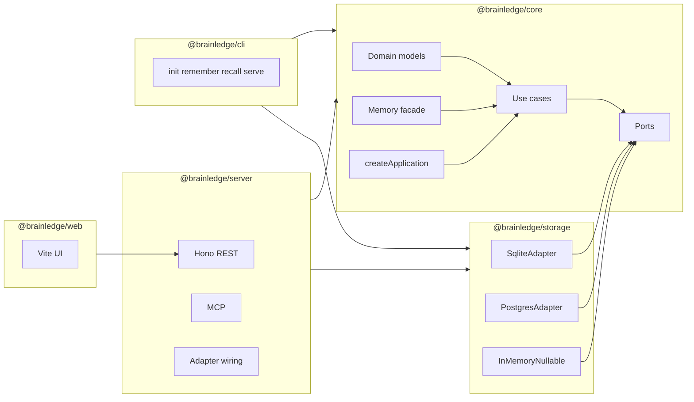
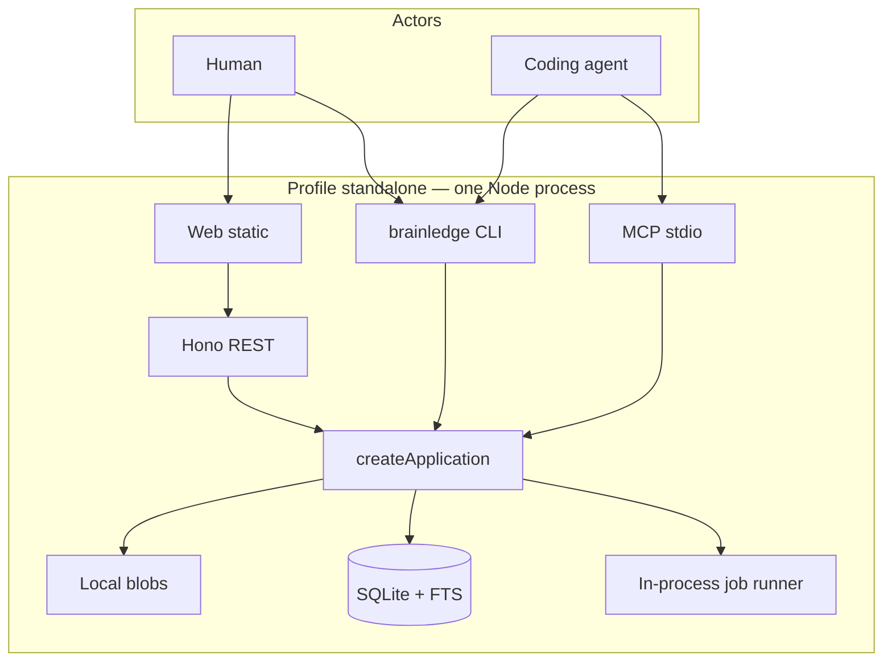
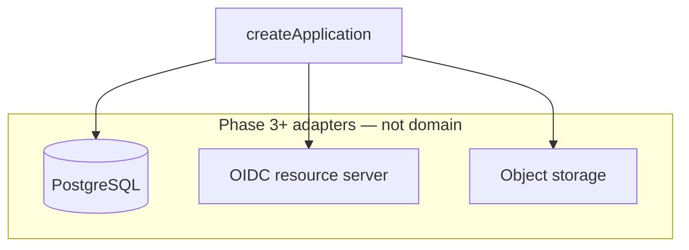
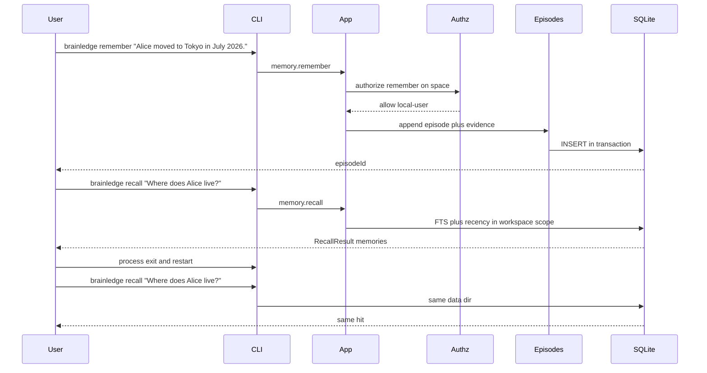
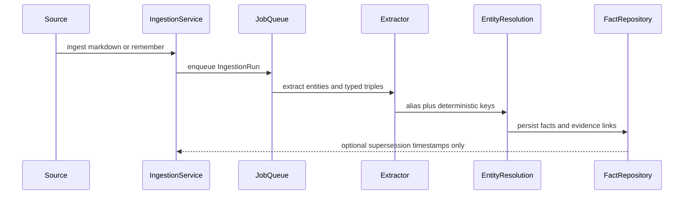

# RFC 0001: Standalone-First TypeScript Context, Memory, and Knowledge Platform

- **Status:** Accepted
- **Date:** 2026-08-18
- **Product:** Brainledge
- **CLI:** `brainledge`
- **npm scope:** `@brainledge/*`
- **Language:** TypeScript (ESM, `module: NodeNext`)
- **Repository:** this monorepo, following `yu-iskw/typescript-template` conventions
- **Scope:** Architecture RFC + P0/P1/P2 backlog mapped to delivery phases 0–7

This document is the **accepted** revision of the original design RFC. Implementation follows walking-skeleton-first sequencing. Original item IDs (`P0-001` … `P2-020`) remain the traceability tags.

---

## 0. Executive summary

Brainledge is a **standalone-first TypeScript context, memory, and knowledge platform**.

The product goal:

> Provide durable, explainable, temporally correct context, memory, and knowledge for people and AI agents, while remaining genuinely useful as a zero-infrastructure standalone application for individuals and scaling to enterprise multi-user deployments from the same codebase.

An individual can install Brainledge and run it with:

- one Node.js process;
- one local data directory (`$BRAINLEDGE_DATA_DIR` or `~/.brainledge`);
- no Docker, PostgreSQL, graph database, Kubernetes, message broker, identity provider, or cloud account.

The same domain model and application services support enterprise deployments with OIDC, principals, organizations and workspaces, object-level authorization, PostgreSQL, optional vector/graph/RDF adapters, durable jobs, object storage, audit, policy, remote REST and MCP, and horizontally scalable API and workers.

The first implementation is a **modular monolith with strong ports and adapters**. Distributed workers and specialized stores are deployment options, not domain requirements.

Lessons retained from reference systems (learn, do not port):

- **Semantica** — ontology, formal validation, deterministic reasoning, provenance, policies, decisions, backend-independent semantic abstractions
- **Graphiti** — explicit temporal fact semantics, source episodes, incremental fact invalidation
- **Cognee** — `remember` / `recall` / `forget` developer experience, session vs durable memory, usable ACL model, standalone-friendly ergonomics
- **TrustGraph** — explicit workspace boundary, authentication vs authorization separation, principal-aware enterprise control plane
- **typescript-template** — pnpm workspace, Node >=22 (pin 24.15+ for `node:sqlite`), strict TypeScript, type-aware ESLint, Vitest, Trunk, Knip, supply-chain controls, `AGENTS.md`

---

## Locked decisions

These decisions are **accepted** and must not be re-litigated in implementation without a superseding ADR.

1. **Canonical fact = typed temporal triple.** `subject` is `EntityRef`, `predicate` is `PredicateRef`, `object` is `EntityRef | LiteralValue` (via `FactObject`). Envelope fields: `validFrom`, `validUntil`, `assertedAt`, `retractedAt`. Raw text lives on `Episode`. Extraction is a later pipeline, not `remember()`.
2. **`createApplication(ports)` lives in `@brainledge/core`.** CLI and server only construct adapters and pass them in. No global registry. No plugin runtime in P0/Phase 1.
3. **ESM + `NodeNext`.** All Brainledge packages use `"type": "module"`, `module: NodeNext`, `target: ES2022`. The template `commonjs` / `es2016` default does not apply.
4. **HTTP is Hono** (`hono` + `@hono/node-server`) with Zod schemas; OpenAPI is generated from the same Zod source. In-process tests do not need `listen()`.
5. **SQLite is `node:sqlite` `DatabaseSync`.** Zero native addons for standalone. Wrap `BEGIN`/`COMMIT` ourselves (no `db.transaction()`). Pin Node to a 24.x that has sqlite RC (`>=24.15` preferred). Fallback ADR: swap to `better-sqlite3` only if `node:sqlite` regresses.
6. **Walking-skeleton-first.** The first green path is CLI + in-process core + SQLite `remember` → `recall` → process restart → `recall`. Postgres / OIDC / web / MCP compile as stubs with ports until later phases. The Phase 1 e2e is a breakage tripwire that later phases must keep green.
7. **Implement ALL original P0, P1, and P2 items.** Original “P2 only after demand” is **sequencing**, not a cut. P2 ships as **optional runtime adapters**; standalone still runs with them unconfigured.

---

## Revision log (defects fixed vs original RFC)

The original RFC’s **direction is right**. Its **delivery shape would recreate Semantica’s serving gap**: many contracts, no coherent product path. This revision fixes:

1. **P0 was three phases labeled as one.** Original P0-031..038 (OIDC, Compose, isolation e2e, production container) contradict “do not start enterprise before the standalone path is pleasant.” They move to Phase 3.
2. **Undefined types.** `FactValue`, `EntityRef`, `PredicateRef`, `PrincipalRef` were used and never defined. They are locked below.
3. **Retraction was dual-coded.** `status: 'retracted'` and `retractedAt` could disagree. Rule: `retractedAt` is source of truth; `status` is derived except `disputed`, which is explicit.
4. **P0 demo overclaimed semantics.** `recall "Where does Alice live?"` after `remember "Alice moved to Tokyo..."` implied extraction. P0/Phase 1 recall is **lexical + recency over episode text**. Fact extraction is Phase 4.
5. **No composition root.** CLI “calls core directly” and server “composes the app” would duplicate wiring. `createApplication(ports)` lives in `@brainledge/core`.
6. **No Clock / UnitOfWork ports.** “What did we believe at T?” and “transaction rollback” in contract tests are untestable without them. Required in the skeleton.
7. **Plugin runtime in P0 is premature.** Explicit `createApplication({ ...adapters })` only. Plugin manifests/API versions are Phase 5.
8. **Template CJS vs platform ESM.** Brainledge packages are ESM + `NodeNext`.
9. **SQLite driver unspecified.** Locked to `node:sqlite` `DatabaseSync`.
10. **HTTP framework unspecified.** Locked to Hono.
11. **Vector search in P0 fights the skeleton.** P0/Phase 1 recall is FTS + recency. Embedding port is a Nullable that returns empty. Exact SQL cosine is Phase 2 after the path is pleasant.
12. **80% Vitest coverage vs empty stubs.** Skeleton implementations must be real enough (sqlite remember/recall) that core + sqlite meet root thresholds. Stub packages (`web`, MCP tools) are excluded from coverage until they grow.
13. **Tests must not use `vi.mock` for providers.** Nullables / fake adapters in production-shaped ports (`FakeEmbeddingProvider`, `InMemoryRepositories`).
14. **Three-level tenancy is right for enterprise and toxic for UX.** Keep Organization → Workspace → KnowledgeSpace in the domain. Standalone auto-creates `local` / `personal` / default space. User-facing API says **`space`**, never org/workspace, until enterprise UI exists.
15. **TrustGraph lesson.** Never trust a caller-supplied workspace id as the isolation boundary. Every repository method takes `workspaceId` from **authorized context**, not from the client body alone.
16. **Composition root was in `server`.** Original §6.3 put application composition in `@brainledge/server`. CLI would then re-implement wiring. Composition is in `core`.
17. **CLI binary was `app`.** Binary name is `brainledge`.
18. **P2 was demand-gated.** All twenty P2 items are implemented as optional adapters in Phase 7.

**Unchanged:** one semantic model, SQL baseline, append-only history, authn ≠ authz, memory as facade, no mandatory graph DB, loopback fail-closed, MCP and REST share use cases, `core` imports no frameworks.

---

## 1. Problem statement

Modern AI agents need more than retrieval over documents. They need a durable layer that can represent:

- what was observed;
- where it came from;
- when it was true;
- whether it is still believed;
- who is allowed to see it;
- how it relates to other facts;
- what policies constrain its use;
- what decisions were made from it;
- how to reconstruct the evidence behind a decision.

Most enterprise-oriented knowledge platforms impose enough infrastructure that an individual cannot use them as a personal memory. Brainledge solves two competing problems as **different deployments of the same contracts**:

1. Standalone simplicity for one person.
2. Enterprise correctness for many people and agents.

---

## 2. Goals

1. **Standalone out of the box** — one command starts the application; no external services; data survives restarts; backup and restore are simple; local web UI, CLI, REST, and MCP share the same local knowledge; authentication is not imposed on a loopback-only process; unsafe external binding is fail-closed.
2. **Enterprise-ready from the data model upward** — every durable object belongs to an authorization scope; human, service, and agent principals are first-class; organization/workspace boundaries exist in domain contracts from day one; storage adapters cannot accidentally perform unscoped cross-workspace reads; enterprise authentication can be added without rewriting business logic.
3. **Canonical temporal and provenance semantics** — distinguish real-world validity time from system assertion time; preserve source evidence; support fact invalidation without destroying history; answer “what did we believe at time T?” and “what was true at time T?”
4. **Agent-friendly memory API** — simple `remember`, `recall`, `forget`; advanced knowledge, ontology, provenance, and reasoning APIs remain available.
5. **Formal semantics where they add value** — RDF interoperability, ontology types, SHACL-style validation, deterministic rules, explainable inference, policy evaluation, decision provenance.
6. **Cloud/provider neutrality** — local mode must not depend on a cloud; enterprise mode can target Google Cloud, AWS, Kubernetes, or conventional VMs; model providers are adapters.
7. **AI-coding friendliness** — small explicit package boundaries, strong type contracts, no hidden global registries, no implicit magic DI, fast unit tests, architecture rules coding agents can follow mechanically.

---

## 3. Non-goals

The product must **not**:

- become a general-purpose agent framework;
- implement its own LLM;
- require Neo4j, an RDF database, Kafka, Pulsar, Cassandra, or Kubernetes;
- become a full enterprise search product;
- replace document repositories;
- implement a workflow engine comparable to Temporal;
- implement every OWL reasoning profile;
- run arbitrary third-party plugin code inside the main enterprise process;
- create separate standalone and enterprise forks;
- make vector search the canonical source of truth;
- make graph storage the canonical source of truth.

Agent frameworks consume Brainledge through SDK, REST, MCP, or A2A-compatible integrations.

---

## 4. Design principles

### 4.1 One semantic model, multiple deployment profiles

The same `Fact`, `Evidence`, `Workspace`, `Memory`, `Decision`, and authorization contracts are used in all modes. Deployment differences belong behind ports. Do not write `if (enterpriseMode) { /* different domain logic */ }`.

### 4.2 SQL is sufficient as the baseline persistence model

A dedicated graph database is optional. The canonical graph is represented by normalized SQL tables (entities, facts, evidence, aliases, ontology types, and joins). SQLite is viable for individuals; PostgreSQL is viable for enterprises. Specialized graph or RDF databases are later projections.

### 4.3 Append history; do not overwrite truth silently

When an assertion changes, preserve history. Prefer supersession timestamps (`validUntil`, `retractedAt`) over mutating fact A into fact B.

### 4.4 Authentication and authorization are separate

- Authentication: who is this caller?
- Authorization: may this principal perform this action on this resource in this context?

The HTTP layer authenticates. Application use cases authorize. Persistence is always workspace-scoped as defense in depth.

### 4.5 Memory is an API abstraction, not the storage model

`remember()` is easy. Internally it may create an episode, a document, entities, facts, evidence, embeddings, and jobs. P0/Phase 1 only writes Episode + Evidence. Extraction is Phase 4.

### 4.6 Explicit capability boundaries beat package explosion

Start with five workspace packages. Create a new package only when it is published separately, requires materially different runtime dependencies, forms a security boundary, or has an independent deployment lifecycle. Do not create one package per domain noun.

---

## 5. Repository conventions

Preserve typescript-template conventions:

- pnpm workspace (pnpm 11);
- Node.js >= 22 (pin 24.15+ for `node:sqlite`);
- TypeScript 5.x with type-aware linting;
- Vitest; Trunk; ESLint (TypeScript, SonarJS, import-x, security, Unicorn, Vitest);
- Knip; 7-day `minimumReleaseAge`; `allowBuilds`; `workspace:*`;
- `AGENTS.md` as the cross-agent source of truth;
- kebab-case filenames; no implicit `any`; import cycle detection; complexity limits;
- Apache-2.0 license.

Brainledge-specific: `"type": "module"`, `module: NodeNext`, `target: ES2022`. Binary name: `brainledge`.

---

## 6. Package layout

```text
.
├── AGENTS.md
├── docs/
│   ├── adr/
│   └── rfc/
└── packages/
    ├── core/       @brainledge/core
    ├── storage/    @brainledge/storage
    ├── server/     @brainledge/server
    ├── cli/        @brainledge/cli
    └── web/        @brainledge/web
```



### 6.1 `@brainledge/core`

Domain models, use cases, ports, authorization contracts, temporal model, provenance model, memory facade, ontology/reasoning/ingestion interfaces, plugin contracts, **`createApplication`**.

Must not import: `hono`, `node:sqlite`, `pg`, React, cloud SDKs, vendor LLM SDKs. Guard test fails the build if it does.

### 6.2 `@brainledge/storage`

First-party persistence adapters: sqlite, postgres, in-memory Nullable, migrations, vector SQL, contract tests. Do not split SQLite and PostgreSQL into separate packages initially. `pg` may be an optional dependency so standalone installs stay slim.

### 6.3 `@brainledge/server`

REST (Hono), MCP, authentication adapters, HTTP context mapping, adapter wiring (constructs ports, calls `createApplication`), worker entry point, background-job adapters, OpenAPI, observability, health/readiness.

One image, two roles:

```bash
node dist/server.js api
node dist/server.js worker
```

Standalone can run both roles in one process.

### 6.4 `@brainledge/cli`

Commands: `init`, `serve`, `status`, `remember`, `recall`, `import`, `export`, `backup`, `restore`, `doctor`, `mcp`. Embedded mode constructs adapters and calls `createApplication`. `--server` talks REST.

### 6.5 `@brainledge/web`

React/Vite UI for memory, recall, spaces, ingestion, later graph/provenance/timeline/decisions/admin. The standalone server serves the production build.

---

## 7. Profile: standalone

User: one individual on a laptop. Requirements: no Docker, no external DB, macOS/Linux first (Windows remains possible), loopback bind by default, local durable data, easy backup, optional remote or local model APIs, stdio MCP, optional loopback HTTP MCP, web UI.



Identity: deterministic implicit principal `local-user`, organization `local`, workspace `personal`, default knowledge space. No login screens. If the process binds to anything other than loopback, startup fails unless authentication is explicitly configured.

Storage: SQLite canonical data; SQLite FTS lexical search; embeddings in SQLite (Phase 2); exact in-process cosine for small collections; local filesystem for blobs and exports.

Jobs: durable `jobs` / `job_attempts` table; transactional claim; crash does not silently lose an ingestion request. Phase 1 runner may claim zero job types; the table still exists.

Backup archive: `database.sqlite`, `blobs/`, `config.json`, schema version. Restore validates version.

Data dir: `$BRAINLEDGE_DATA_DIR` or `~/.brainledge`. Config requires explicit `profile: standalone | enterprise` — never infer enterprise from a URL.

---

## 8. Profile: enterprise-dev

Same contracts as standalone. Compose: app + worker + Postgres; optional `--profile auth` and `--profile object-storage`. OIDC against a local issuer. Isolation e2e: principal A cannot query workspace B. PostgreSQL FTS for lexical search.

---

## 9. Profile: enterprise-prod

Same contracts. API and worker processes, PostgreSQL (AlloyDB-compatible), object storage, OIDC resource server, durable workers with `SKIP LOCKED` / outbox, audit, OpenTelemetry. Optional adapters (vector extension, graph/RDF projection, policy engine, brokers) are not required to boot.



---

## 10. Canonical domain model

### 10.1 Principal

A principal is a human, service, or agent that can act. Standalone auto-creates `local-user`. Enterprise maps OIDC subject → Principal and does **not** map authorization from arbitrary claims.

### 10.2 Organization and workspace

Three-level tenancy exists in the domain from day one:

- Organization
- Workspace (authorization isolation boundary)
- Knowledge space (user-facing `space`)

Standalone auto-creates `local` / `personal` / default space. User-facing APIs say `space` until enterprise UI exists.

### 10.3 Knowledge space

A space holds episodes, entities, facts, evidence, decisions, and grants (`reader` / `editor` / `admin`). Private spaces are not visible to workspace admins unless policy allows.

---

## 11. Memory vs knowledge vs context vs decision

These terms have precise meanings (see also [ADR 0006](../adr/0006-memory-vs-knowledge-vs-context-vs-decision.md)):

- **Memory** — an observation retained by the system (chat turn, note, event, document, tool result). May later produce structured facts.
- **Knowledge** — durable claims represented as typed temporal facts and relationships, potentially validated by an ontology.
- **Context** — a situation-specific selection of memories, facts, policies, and prior decisions assembled for a particular task. May be ephemeral. A snapshot can be persisted when auditability requires reproducibility.
- **Decision** — a durable action, choice, or recommendation with structured reason codes, facts, rules, and evidence. Do not store only free-form LLM reasoning.
- **Provenance** — a graph over `source → episode → extraction → fact → inference → context → decision`.

---

## 12. Domain types (locked)

Branded IDs and the typed temporal triple are the canonical types. `retractedAt` is the source of truth for retraction. `status: 'disputed'` is explicit and is **not** derived from timestamps.

```ts
export type PrincipalId = string & { readonly __brand: 'PrincipalId' };
export type OrganizationId = string & { readonly __brand: 'OrganizationId' };
export type WorkspaceId = string & { readonly __brand: 'WorkspaceId' };
export type KnowledgeSpaceId = string & { readonly __brand: 'KnowledgeSpaceId' };
export type EpisodeId = string & { readonly __brand: 'EpisodeId' };
export type EntityId = string & { readonly __brand: 'EntityId' };
export type FactId = string & { readonly __brand: 'FactId' };
export type EvidenceId = string & { readonly __brand: 'EvidenceId' };

export type IsoUtcTimestamp = string & { readonly __brand: 'IsoUtcTimestamp' };

export interface EntityRef {
  entityId: EntityId;
}

export interface PredicateRef {
  id: string; // ontology id or well-known slug
}

export interface PrincipalRef {
  principalId: PrincipalId;
}

export type LiteralValue =
  | { readonly kind: 'text'; readonly value: string }
  | { readonly kind: 'number'; readonly value: number }
  | { readonly kind: 'boolean'; readonly value: boolean }
  | { readonly kind: 'timestamp'; readonly value: IsoUtcTimestamp };

export type FactObject = { readonly kind: 'entity'; readonly entity: EntityRef } | LiteralValue;

export type FactStatus = 'active' | 'inferred' | 'retracted' | 'disputed';

export interface Fact {
  id: FactId;
  workspaceId: WorkspaceId;
  knowledgeSpaceId: KnowledgeSpaceId;
  subject: EntityRef;
  predicate: PredicateRef;
  object: FactObject;
  validFrom?: IsoUtcTimestamp;
  validUntil?: IsoUtcTimestamp;
  assertedAt: IsoUtcTimestamp;
  retractedAt?: IsoUtcTimestamp;
  referenceTime?: IsoUtcTimestamp;
  confidence?: number;
  status: FactStatus; // disputed is explicit; retracted iff retractedAt set
  createdBy: PrincipalRef;
}
```

Invariant tests:

- `retractedAt` set ⇒ `status === 'retracted'`
- `status === 'retracted'` ⇒ `retractedAt` set
- `status === 'disputed'` may coexist with a non-null `retractedAt` only if an ADR later allows it; until then, disputed facts remain unretracted
- contradictory facts may share subject+predicate with overlapping validity
- every repository method requires `workspaceId` from authorized context

Evidence is separate from facts:

```ts
export interface Evidence {
  id: EvidenceId;
  workspaceId: WorkspaceId;
  sourceType: 'episode' | 'document' | 'tool-result' | 'manual' | 'inference';
  sourceId: string;
  locator?: string;
  contentHash?: string;
  observedAt: IsoUtcTimestamp;
}

export interface FactEvidence {
  factId: FactId;
  evidenceId: EvidenceId;
  relation: 'supports' | 'contradicts' | 'derived-from';
}
```

### 12.1 Entity

```ts
export interface Entity {
  id: EntityId;
  workspaceId: WorkspaceId;
  knowledgeSpaceId: KnowledgeSpaceId;
  canonicalName: string;
  typeIds: readonly string[];
  createdAt: IsoUtcTimestamp;
  deletedAt?: IsoUtcTimestamp;
}

export interface EntityAlias {
  entityId: EntityId;
  value: string;
  normalizedValue: string;
  sourceEvidenceId?: EvidenceId;
}
```

Entity resolution is a use case, not a database side effect. Merges are recorded, never silent.

### 12.2 Episode

```ts
export interface Episode {
  id: EpisodeId;
  workspaceId: WorkspaceId;
  knowledgeSpaceId: KnowledgeSpaceId;
  principalId?: PrincipalId;
  kind: 'conversation' | 'note' | 'document' | 'event' | 'tool-result' | 'observation';
  referenceTime?: IsoUtcTimestamp;
  observedAt: IsoUtcTimestamp;
  contentHash: string;
  content: string; // raw text; extraction does not mutate this
  metadata: Readonly<Record<string, unknown>>;
}
```

Episodes preserve observation history even when extracted facts later change.

### 12.3 Decision

```ts
export interface Decision {
  id: string;
  workspaceId: WorkspaceId;
  knowledgeSpaceId: KnowledgeSpaceId;
  actor: PrincipalRef;
  action: string;
  status: 'proposed' | 'approved' | 'executed' | 'rejected';
  contextSnapshotId?: string;
  policyEvaluationIds: readonly string[];
  evidenceIds: readonly EvidenceId[];
  supportingFactIds: readonly FactId[];
  explanation?: string;
  createdAt: IsoUtcTimestamp;
  executedAt?: IsoUtcTimestamp;
}
```

---

## 13. Memory facade

High-level developer API. This is the Cognee-shaped surface; it is not a second storage universe.

```ts
await memory.remember({ spaceId, content, kind: 'note' });
await memory.recall({ spaceId, query, limit: 20 });
await memory.forget({ spaceId, memoryId, mode: 'hide' | 'delete' });
// later:
await memory.forget({ spaceId, memoryId, mode: 'retract' | 'purge' });
await memory.consolidate({ spaceId });
```

**P0 / Phase 1:**

- `remember` writes Episode + Evidence (synchronous).
- `recall` is **lexical (SQLite FTS) + recency over episode text**. It returns structured `RecallResult` with memories populated; `facts` and `entities` arrays are empty until Phase 4.
- `forget` supports `hide` and `delete` only. `retract` and `purge` are Phase 6 (P1-035).
- No LLM, no extraction, no embeddings required.

**Phase 4+:** `consolidate` extracts facts, resolves entities, supersedes obsolete facts, updates embeddings, runs ontology validation. Asynchronous when expensive.



P0 recall hitting “Tokyo” / “Alice” is a **lexical** success, not a claim that a `livesIn` triple exists.

---

## 14. Low-level knowledge APIs

Advanced users need explicit access (Phase 4+):

- `knowledge.ingest` / `queryFacts` / `queryEntities` / `getTimeline` / `traceProvenance` / `findContradictions`
- `ontology.validate` / `getTypes`
- `reasoning.infer` / `explain`
- `decisions.record` / `getEvidence`

The memory facade calls these internally.

---

## 15. Ingestion architecture



Pipeline: Source → Acquire → Parse → Normalize → Segment → Episode + Evidence → (Phase 4) Extract → Resolve → Persist facts.

`IngestionRun` states: queued / running / succeeded / failed / cancelled, plus an idempotency key. Phase 2 ships the text/Markdown vertical slice without extraction. Phase 4 fills extract.

SSRF-safe URL ingestion, content-type checks, size limits, path-traversal protection.

---

## 16. Job execution

`JobQueue` is a port. Adapters:

- Phase 2: SQLite in-process runner
- Phase 3/6: PostgreSQL workers (`SKIP LOCKED` / outbox) before any broker
- Phase 7: Cloud Tasks / Pub/Sub / SQS adapters

Remember stays synchronous. Expensive work uses the queue. Crash-safe claim + retry + `job_attempts`.

---

## 17. Persistence strategy

Canonical store is SQL (SQLite or PostgreSQL). Search:

- **Lexical** — SQLite FTS5; PostgreSQL FTS in enterprise
- **Vector** — embeddings stored in SQL; exact cosine with a documented scale limit; can be disabled; recall still works if disabled
- **Graph** — SQL neighborhood/path queries first; `GraphProjectionPort` unused until Phase 7 LPG adapter

Vector indexes and graph indexes are **projections, not truth**.

---

## 18. Why no mandatory graph database?

Graph queries over SQL are sufficient for neighbors, paths, related entities, and temporal neighborhood. An LPG or RDF store is an optional projection. Requiring Neo4j or an RDF database would kill standalone.

---

## 19. RDF interoperability boundary

RDF/JSON-LD is an **export and optional projection**, not the memory API. Memory types stay TypeScript domain types. Phase 5 exports entities, facts, and evidence. Phase 7 may add a SPARQL backend. See [ADR 0010](../adr/0010-rdf-interoperability-boundary.md).

---

## 20. Ontology, reasoning, plugins

- **P0/Phase 1:** ports only
- **Phase 5:** ontology registry per workspace/space; SHACL-compatible validation spike; safe rule DSL (no arbitrary JS); Datalog-style evaluator with finite facts, no unsafe vars, recursion limits, max inferences, explanation records; inference provenance
- **Phase 5 plugins:** compile-time registration `createApplication({ plugins })`; reject incompatible `apiVersion`; plugins receive capability-scoped ports, never raw DB
- **Phase 7:** richer OWL profiles actually used by fixtures; incremental Rete-style engine after benchmark vs Datalog

---

## 21. Model providers

Ports: `TextGenerationProvider`, `EmbeddingProvider` with timeout, cancellation, retry classification, usage metadata.

- Fake/Nullable providers in core tests (no network, no `vi.mock`)
- Phase 2: OpenAI-compatible adapter (OpenAI, OpenRouter, local/Ollama-compatible URLs)
- Phase 6: dedicated Vertex AI and Anthropic adapters on the same ports
- Offline: remember / recall / lexical remain usable with no provider configured

See [ADR 0011](../adr/0011-model-provider-abstraction.md).

---

## 22. REST API

Hono REST `/api/v1` (Phase 2 routes exist even when collections are empty so OpenAPI stays stable):

- `GET /me`
- workspaces (hidden in standalone UX)
- spaces CRUD
- `POST .../memories`, `POST .../recall`
- ingestions and ingestion status
- entity/fact reads (empty until Phase 4)
- provenance (empty until Phase 4)
- decisions (empty until Phase 5)
- timeline, export

Also: schema validation, pagination, request IDs, idempotency keys on mutations.

Error envelope:

```ts
{
  error: {
    code: string;
    message: string;
    requestId: string;
  }
}
```

Never leak stacks. OpenAPI generated from Zod; CI fails on unintended breaks.

Listen policy: loopback default; non-loopback without auth **fails closed**; explicit noisy override name required to bind externally.

---

## 23. MCP architecture

REST and MCP share application services via `createApplication`. See [ADR 0008](../adr/0008-rest-and-mcp-share-application-services.md).

- **Phase 2:** stdio MCP; optional loopback Streamable HTTP MCP at `http://127.0.0.1:<port>/mcp` (no OIDC; same listen-policy as REST)
- **Phase 6:** remote Streamable HTTP MCP behind the same OIDC/authorizer as REST; each tool maps to a platform action
- **Risk profiles:** `memory-read`, `knowledge-read`, `provenance-read`, `ontology-read`, `memory-write`, `knowledge-admin`, `decision-write`. Admin/destructive tools are not in the default profile.
- Payloads separate trusted platform metadata from untrusted source content.

---

## 24. Authentication and authorization

**Standalone:** implicit local principal; optional local API token for automation.

**Enterprise:** OIDC resource server (issuer, audience, signature, expiry, nbf, algorithms). Map subject → Principal. Do not map authz from arbitrary claims.

Authorization always runs in use cases. Database authorizer (Phase 3): workspace membership + space owner + reader/editor/admin grants. P1 extras (Phase 6): groups/roles, service/agent grants, delegated access, org policies. P2 (Phase 7): OpenFGA/Cedar-compatible adapter; PostgreSQL RLS as defense in depth (app authz remains required).

Never trust a caller-supplied workspace id. Repositories take `workspaceId` from authorized context.

---

## 25. Privacy and deletion

Forget modes:

- **hide** (P0) — remove from ordinary recall
- **delete** (P0) — remove normal persisted representation
- **retract** (Phase 6) — preserve history but mark the assertion inactive (`retractedAt`)
- **purge** (Phase 6) — privacy/compliance deletion across derived projections (embeddings, blobs)

A compliance audit event can record that deletion occurred without retaining deleted body content.

---

## 26. Provenance, contradictions, retrieval

Provenance is a graph of machine-readable links, not free-form explanation.

Contradiction service (Phase 4) returns both claims and evidence. Contradictory facts may share subject+predicate with overlapping validity; the platform does not silently pick a winner.

Retrieval pipeline (Phase 4):

```text
scope + authz
  → query understanding
  → lexical + vector + graph-neighborhood candidates
  → temporal filter
  → policy filter
  → rerank hook (nullable until Phase 5)
  → structured RecallResult
```

Built-in strategies: recent, lexical, vector, graph, entity (Phase 4); prior-decision (Phase 5).

Context budget (Phase 5): token-budget builder that exposes omissions.

`RecallResult` is structured from Phase 1 (memories only) and expands in Phases 4–5. Never concatenate undifferentiated text as the only result.

---

## 27. Web, CLI, config, secrets, observability, audit

**Web P0 pages (Phase 2):** overview, memory list, recall, knowledge spaces, ingestion status. Standalone hides org admin.

**Later UI:** provenance explorer, temporal timeline, graph explorer (API projections, not direct DB), enterprise admin (members, grants, spaces, audit).

**CLI (Phase 2 complete):** `init`, `serve`, `status`, `remember`, `recall`, `import`, `export`, `backup`, `restore`, `doctor`, `mcp`. `doctor` checks Node version, data-dir permissions, sqlite integrity, bind policy.

**Config:** flags > env > file > profile defaults. Explicit `APP_PROFILE=standalone|enterprise`.

**Secrets:** not in config files; API keys never logged.

**Logs (Phase 2):** structured with `request_id`, `trace_id`, `principal_id`, `workspace_id`, `knowledge_space_id`, `ingestion_run_id`, `job_id`. No embeddings, no source bodies by default.

**Traces (Phase 6):** OpenTelemetry for request, ingestion, job, model, storage, recall, reasoning.

**Audit (Phase 3):** who / what / result; no deleted body content. Audit ≠ provenance.

---

## 28. Security

Deny-by-default, body/upload limits, secure headers, dependency scanning (template). Untrusted source content is never concatenated into prompts as trusted instructions. MCP and REST separate platform metadata from source bodies.

Phase 6 threat model covers: tenant leakage, prompt injection, malicious docs, SSRF, model leakage, plugin supply chain, authz bypass, audit tampering, remanence.

---

## 29. Cloud mappings and local models

Cloud Run and AWS references live **outside** `packages/core` (Phase 6). Terraform is not a core dependency.

Local models use the OpenAI-compatible adapter pointed at a local endpoint (Phase 2). Dedicated Vertex/Anthropic adapters are Phase 6.

---

## 30. Versioning, migrations, testing, quality, CI

Version independently: REST, MCP, plugin `apiVersion`, SQL schema, export `schemaVersion`.

Migrations are committed and tested against SQLite and PostgreSQL. Fixture upgrades `v0 → current` (Phase 3).

Testing:

- **Unit:** pure functions. No DB. No `vi.mock` for ports.
- **Contract:** `describeStorageAdapter(factory)` for workspace isolation, episode round-trip, transaction rollback, forget hide vs delete. Factories: in-memory, sqlite temp file; Postgres in Phase 3.
- **E2E tripwire:** standalone skeleton (Phase 1). Later: HTTP, MCP, backup/restore, enterprise isolation, extract, purge. Additional tripwires, never replacements.
- **Architecture:** `core` dependency test; repository methods must include `workspaceId`.

Keep template quality gates. Add OpenAPI drift job in Phase 2. Do not republish from arbitrary PRs.

---

## 31. Architecture rules (mechanical)

1. `packages/core` must not import adapter/framework packages (`hono`, `node:sqlite`, `pg`, React, cloud SDKs, vendor LLM SDKs).
2. All durable repository operations require workspace scope from authorized context.
3. All mutation use cases must call authorization.
4. External payloads use runtime schemas.
5. No `any`.
6. No new workspace package without an ADR-level reason.
7. No global mutable singleton registries.
8. No provider-specific types in domain interfaces.
9. Tests must accompany new adapter contracts.
10. Standalone mode must remain functional when enterprise adapters are absent.

---

## 32. ADRs

`adr init docs/adr` created [ADR 0001](../adr/0001-record-architecture-decisions.md) (record architecture decisions). Product ADRs:

- [0002 Canonical SQL source of truth](../adr/0002-canonical-sql-source-of-truth.md)
- [0003 Standalone and enterprise profiles](../adr/0003-standalone-and-enterprise-profiles.md)
- [0004 Workspace authorization boundary](../adr/0004-workspace-authorization-boundary.md)
- [0005 Temporal typed-triple fact model](../adr/0005-temporal-typed-triple-fact-model.md)
- [0006 Memory vs knowledge vs context vs decision](../adr/0006-memory-vs-knowledge-vs-context-vs-decision.md)
- [0007 Composition root without plugin runtime in P0](../adr/0007-composition-root-without-plugin-runtime-in-p0.md)
- [0008 REST and MCP share application services](../adr/0008-rest-and-mcp-share-application-services.md)
- [0009 Durable job execution model](../adr/0009-durable-job-execution-model.md)
- [0010 RDF interoperability boundary](../adr/0010-rdf-interoperability-boundary.md)
- [0011 Model-provider abstraction](../adr/0011-model-provider-abstraction.md)

---

## 33. Delivery phases 0–7

Replace the original linear P0-then-P1-then-demand-gated-P2 list with these phases. Original IDs remain as tags.

### Phase 0 — Spec and identity

Revised RFC, ADRs, `AGENTS.md` invariants, project identity `@brainledge/*`, CLI `brainledge`. No product behavior yet.

### Phase 1 — Walking skeleton

Thin vertical slice that is **real**: IDs, timestamps, Principal/Org/Workspace/KnowledgeSpace, implicit local principal + allow-all local authorizer, SQLite migrations/FKs/FTS5, `remember` / `recall` / `forget(hide|delete)`, workspace-scoped queries, architecture import-guard, `createApplication`.

Allowed Nullables: embedding/generation no-op, job runner claiming zero types, Postgres stub throwing `NotImplementedError`, MCP/web compile stubs, ontology/reasoning/decision ports only.

**Acceptance:** `brainledge init`; `remember` / `recall` with no API keys and no Docker; e2e restart test green; core architecture guard green; FTS finds a substring of the remembered episode.

### Phase 2 — Standalone product surfaces

Fill remaining standalone P0 behind the green e2e: REST, errors, listen policy, local API token, jobs, markdown ingest, OpenAI-compatible adapter, embeddings storage, stdio + loopback HTTP MCP, complete CLI, P0 web pages, backup/restore, config/secrets/logs, security baseline, OpenAPI.

**Acceptance:** laptop demo (lexical recall, restart, MCP stdio, backup/restore, `serve` + UI). Still no OIDC and no Postgres requirement.

### Phase 3 — Enterprise correctness

Real Postgres adapter, OIDC, grants, audit, Compose, container, isolation e2e, PostgreSQL FTS.

### Phase 4 — Structured knowledge and retrieval

Entities/facts tables, extraction, resolution, supersession, contradictions, provenance, consolidate, vector SQL, graph SQL, retrieval pipeline, structured `RecallResult` with facts.

### Phase 5 — Semantic kernel and remaining UX

Ontology, SHACL spike, RDF export, rule DSL + Datalog, decisions, session memory, rerank, token budget, plugin manifests, remaining UIs.

### Phase 6 — Enterprise product completion

Agent principals, delegation, HTTP MCP OAuth, object storage, PG workers, OTel, retention, purge/retract, import-export, migrate, threat model, GCP/AWS refs, Vertex/Anthropic adapters.

### Phase 7 — P2 optional adapters

Implement every P2-001..020 as optional runtime adapters. Standalone still boots with them absent.

---

## 34. Architectural invariants

These belong in `AGENTS.md` and architecture tests.

1. Standalone works without Docker.
2. No graph database is required.
3. No cloud account is required.
4. `core` imports no framework/provider adapters.
5. Every durable knowledge object has workspace scope.
6. Every externally initiated use case has a principal.
7. Every protected use case performs authorization.
8. Temporal validity and assertion time are distinct.
9. Facts preserve evidence.
10. History is not silently overwritten.
11. Vector indexes are projections, not truth.
12. Graph indexes are projections, not truth.
13. MCP and REST call the same application services.
14. Standalone and enterprise do not have separate domain code.
15. Plugins cannot bypass authorization by receiving raw unrestricted repositories.
16. External source content is untrusted.
17. A deletion can identify and remove derived data.
18. Expensive distributed infrastructure requires measured justification.

Additional locked engineering invariants (this revision):

- Packages are ESM with `module: NodeNext`.
- HTTP is Hono.
- Standalone SQLite is `node:sqlite` `DatabaseSync`.
- Tests must not use `vi.mock` for ports; use Nullables / fake adapters.
- The walking-skeleton e2e must stay green.
- `core` must not import `hono`, `node:sqlite`, `pg`, React, cloud SDKs, or vendor LLM SDKs.
- Every repository method requires `workspaceId` from authorized context.

---

## 35. P0 backlog mapped to phases

P0 means: required to produce a coherent standalone-first MVP whose architecture does not block enterprise evolution. Sequencing is phases 0–3, not a single dump.

### P0-001 — Bootstrap from TypeScript template conventions — Phases 0–1

Keep pnpm 11, Trunk, Knip, type-aware ESLint, 7-day `minimumReleaseAge`, Apache-2.0. Rename identity to Brainledge / `@brainledge/*`. Switch packages to ESM + NodeNext.

### P0-002 — Create minimal workspace packages — Phase 1

`core`, `storage`, `server`, `cli`, `web`. Delete `packages/common`. Compile-only stubs are allowed only where this RFC says so.

### P0-003 — Define canonical identifiers and time types — Phase 1

Branded IDs and `IsoUtcTimestamp`. Clock port required.

### P0-004 — Define principal/organization/workspace domain — Phase 1

Types in Phase 1; enterprise enforcement in Phase 3.

### P0-005 — Define knowledge-space domain and grants — Phase 1

Types + standalone default space in Phase 1; grant enforcement in Phase 3.

### P0-006 — Define canonical episode/evidence/fact/entity models — Phase 1 types; Phase 4 tables

TypeScript types + ports in Phase 1. `episodes` / `evidence` tables in Phase 1. `entities` / `facts` / `fact_evidence` tables in Phase 4.

### P0-007 — Define repository ports — Phase 1

Workspace-scoped ports, `Clock`, `UnitOfWork`. Every method takes `workspaceId` from authorized context.

### P0-008 — SQLite schema and migrations — Phase 1

`node:sqlite` `DatabaseSync`. Tables listed in Phase 1. FKs, FTS5, `BEGIN`/`COMMIT` wrappers.

### P0-009 — PostgreSQL adapter contract skeleton — stub Phase 1; real Phase 3

Compiling class throwing `NotImplementedError` in Phase 1. Real adapter + same `describeStorageAdapter` suite in Phase 3.

### P0-010 — Storage contract test suite — Phase 1

`describeStorageAdapter(factory)` against in-memory and sqlite. Postgres factory in Phase 3.

### P0-011 — Standalone application profile — Phase 1

Implicit local principal, allow-all local authorizer, `createApplication`, data dir, explicit `profile: standalone`.

### P0-012 — Safe standalone bind behavior — Phase 2

Loopback default; non-loopback without auth fails closed.

### P0-013 — In-process durable job runner — Phase 2

Table exists in Phase 1 (may claim zero types). Real claim/retry/crash-safety in Phase 2.

### P0-014 — Memory `remember` use case — Phase 1

Writes Episode + Evidence. No extraction.

### P0-015 — Memory `recall` use case — Phase 1

Lexical + recency over episodes. Structured `RecallResult`; facts/entities empty until Phase 4.

### P0-016 — Memory `forget` use case — Phase 1 hide|delete; Phase 6 retract|purge

P0 ships `hide` and `delete`. `retract` and `purge` wait for P1-035.

### P0-017 — Local embeddings representation — Phase 2

Store embeddings in SQL; exact cosine with documented limit; can be disabled. Phase 1 embedding port is a Nullable returning empty.

### P0-018 — Model provider interfaces and fake provider — Phase 2 ports; Phase 1 Nullable

Fake/Nullable in tests. No `vi.mock`.

### P0-019 — Initial provider adapter — Phase 2

OpenAI-compatible adapter covering OpenAI, OpenRouter, and local/Ollama-compatible URLs. Vertex/Anthropic are Phase 6.

### P0-020 — Ingestion run model — Phase 2

`IngestionRun` with queued/running/succeeded/failed/cancelled + idempotency key.

### P0-021 — Text/Markdown ingestion vertical slice — Phase 2

Acquire → parse → normalize → segment → episode + evidence. Extract later.

### P0-022 — REST server — Phase 2

Hono `/api/v1` resources listed in §22. Health stub may compile in Phase 1.

### P0-023 — Stable REST error model — Phase 2

`{ error: { code, message, requestId } }`. Never leak stacks.

### P0-024 — Standalone CLI — Phase 1 subset; Phase 2 complete

Phase 1: `init`, `remember`, `recall`. Phase 2: `serve`, `status`, `import`, `export`, `backup`, `restore`, `doctor`, `mcp`, `--server`.

### P0-025 — MCP stdio server — Phase 2

Shares `createApplication`. Compile stub allowed in Phase 1.

### P0-026 — MCP risk profiles — Phase 2

Profiles listed in §23. Admin/destructive not in default.

### P0-027 — Basic web UI — Phase 2

Overview, memory list, recall, spaces, ingestion status. Vite placeholder that builds in Phase 1.

### P0-028 — Backup and restore — Phase 2

Archive includes sqlite, `blobs/`, `config.json`, schema version. Round-trip e2e.

### P0-029 — Authorization enforcement in core use cases — Phase 1

Use cases authorize even when the local authorizer allows all.

### P0-030 — Standalone implicit authorizer — Phase 1

Allow-all for `local-user` on the personal workspace. Optional local API token in Phase 2.

### P0-031 — Enterprise JWT/OIDC resource-server adapter — Phase 3

Issuer, audience, signature, expiry, nbf, algorithms. Map subject → Principal.

### P0-032 — Enterprise authorization adapter — Phase 3

Membership + grants. Private spaces not visible to workspace admins unless policy allows.

### P0-033 — Audit log — Phase 3

Who / what / result. No deleted body content.

### P0-034 — Structured logging and request correlation — Phase 2

Fields listed in §27. No embeddings, no source bodies by default.

### P0-035 — Docker Compose enterprise development profile — Phase 3

App + worker + Postgres; optional auth and object-storage profiles.

### P0-036 — Production container — Phase 3

One image, `node dist/server.js api|worker`.

### P0-037 — Full standalone E2E test — Phase 1 tripwire; Phase 2 expands

Phase 1: remember → recall → restart → recall. Phase 2 adds HTTP, MCP, backup/restore.

### P0-038 — Enterprise isolation E2E test — Phase 3

A cannot query B (REST and repository).

### P0-039 — OpenAPI generation — Phase 2

From Zod. CI drift check.

### P0-040 — Architecture guard tests — Phase 1

`core` import guard; repository methods require `workspaceId`.

---

## 36. P1 backlog mapped to phases

### P1-001 — Entity extraction pipeline — Phase 4

Structured schemas + extraction provenance.

### P1-002 — Entity resolution — Phase 4

Exact alias, deterministic keys, candidate similarity, optional model assist. Merges recorded, not silent.

### P1-003 — Fact extraction — Phase 4

Typed triples. Reject malformed LLM output via runtime schemas.

### P1-004 — Temporal supersession — Phase 4

Set `validUntil` / `retractedAt`. Never delete history.

### P1-005 — Contradiction service — Phase 4

Returns both claims and evidence.

### P1-006 — Vector adapter benchmark — Phase 4

Record a benchmark before any embedded native index. Document 10k/100k notes.

### P1-007 — PostgreSQL vector adapter — Phase 4

Same `EmbeddingIndex` / vector port as SQLite exact cosine.

### P1-008 — Graph query service — Phase 4

Neighbors, paths, related entities, temporal neighborhood over SQL.

### P1-009 — Optional LPG projection port — Phase 4 define; Phase 7 implement

`GraphProjectionPort` defined and unused until P2-004.

### P1-010 — RDF export — Phase 5

RDF/JSON-LD of entities, facts, evidence. No RDF types on the memory API.

### P1-011 — Ontology registry — Phase 5

Per workspace/space. `getEntityType` / `getPredicate` / `validateFacts`.

### P1-012 — SHACL-compatible validation spike — Phase 5

Spike + ADR. Not a full SHACL engine in-process unless the spike justifies it.

### P1-013 — Deterministic rule DSL — Phase 5

Safe DSL. No arbitrary JavaScript.

### P1-014 — Datalog-style rule evaluator — Phase 5

Finite facts, no unsafe vars, recursion limits, max inferences, explanation records.

### P1-015 — Inference provenance — Phase 5

Rule, input facts, evidence, engine version, timestamp.

### P1-016 — Decision service — Phase 5

Structured decisions, not free-form LLM traces.

### P1-017 — Context snapshots — Phase 5

Persist assembled context when auditability requires reproducibility.

### P1-018 — `memory.consolidate` — Phase 4

Async extraction, resolution, supersession, embeddings, ontology validation.

### P1-019 — Session memory — Phase 5

`sessionId` fast path that can consolidate later.

### P1-020 — Retrieval strategy plugins — Phase 4 core set; Phase 5 prior-decision

Recent, lexical, vector, graph, entity in Phase 4; prior-decision in Phase 5.

### P1-021 — Reranking port — Phase 5

Nullable until an adapter is configured.

### P1-022 — Token-budget-aware context builder — Phase 5

Expose omissions.

### P1-023 — Provenance explorer UI — Phase 5

Walk source → episode → fact → decision. API projections, not direct DB.

### P1-024 — Temporal timeline UI — Phase 5

### P1-025 — Graph explorer UI — Phase 5

### P1-026 — Enterprise workspace administration UI — Phase 5

Members, grants, spaces, audit.

### P1-027 — Service and agent principals — Phase 6

First-class principal kinds.

### P1-028 — Delegation model — Phase 6

`human→agent` / `service→agent` with scoped grants and expiry. Do not copy unrestricted bearer tokens into jobs. Record delegator vs actor.

### P1-029 — Remote HTTP MCP OAuth — Phase 6

Same OIDC/authorizer as REST.

### P1-030 — Fine-grained MCP tool authorization — Phase 6

Each tool maps to a platform action.

### P1-031 — Object storage adapter — Phase 6

Local FS default; GCS/S3-compatible adapter.

### P1-032 — PostgreSQL durable worker — Phase 6

`SKIP LOCKED` / outbox before any broker.

### P1-033 — OpenTelemetry traces — Phase 6

Request, ingestion, job, model, storage, recall, reasoning.

### P1-034 — Retention policy — Phase 6

Per-space retention for episodes, blobs, embeddings, audit, provenance.

### P1-035 — Purge engine — Phase 6

Forget modes `retract` and `purge` plus derived-artifact tracking.

### P1-036 — Import/export format — Phase 6

Versioned archive (`schemaVersion`) standalone ↔ enterprise.

### P1-037 — Standalone-to-enterprise migration command — Phase 6

`brainledge migrate --from ... --to ... --space ...` with explicit consent.

### P1-038 — Cloud Run deployment reference — Phase 6

Terraform outside `packages/core`.

### P1-039 — AWS deployment reference — Phase 6

Contract parity with the GCP mapping.

### P1-040 — Threat model — Phase 6

Tenant leakage, prompt injection, malicious docs, SSRF, model leakage, plugin supply chain, authz bypass, audit tampering, remanence.

---

## 37. P2 backlog mapped to phases

Original RFC said “only after demand.” **This RFC implements all of them** as optional runtime adapters in Phase 7. Standalone and enterprise keep working with them unconfigured. Each item needs a port, at least one adapter or documented no-op, tests, and a boot path that does not require the adapter.

### P2-001 — Advanced policy engine — Phase 7

OpenFGA/Cedar-compatible adapter. Not mandatory.

### P2-002 — PostgreSQL Row Level Security — Phase 7

Defense in depth. App authz remains required.

### P2-003 — RDF/SPARQL projection — Phase 7

Optional SPARQL backend. Canonical store remains SQL.

### P2-004 — Neo4j/LPG projection — Phase 7

Implements `GraphProjectionPort`.

### P2-005 — Incremental Rete-style engine — Phase 7

Behind `RuleEngine` after benchmark vs Datalog.

### P2-006 — Richer OWL reasoning — Phase 7

Profiles actually used by tests/fixtures. Not every OWL profile (non-goal).

### P2-007 — Durable external task queues — Phase 7

Cloud Tasks / Pub/Sub / SQS adapters.

### P2-008 — Event subscriptions/webhooks — Phase 7

With auth review.

### P2-009 — A2A interface — Phase 7

A2A-compatible. Core is not coupled to one agent framework.

### P2-010 — MCP Apps — Phase 7

Visualizations for graph/timeline/provenance/decision. Web UI remains independent.

### P2-011 — Federated knowledge spaces — Phase 7

Share without copying all facts.

### P2-012 — Cross-region replication strategy — Phase 7

Document + hook points.

### P2-013 — Bring-your-own-KMS encryption domains — Phase 7

### P2-014 — Legal hold — Phase 7

Distinct from retention.

### P2-015 — Data classification and masking — Phase 7

Labels + masking at recall.

### P2-016 — Differential context policies for agents — Phase 7

Agent may see less than delegator. Phase 6 at least records delegator vs actor.

### P2-017 — Automated quality evaluation — Phase 7

Extraction, resolution, temporal, recall, contradiction, inference, authz leakage.

### P2-018 — Multi-model extraction arbitration — Phase 7

### P2-019 — Knowledge lifecycle automation — Phase 7

Stale facts → revalidation.

### P2-020 — Enterprise compliance packs — Phase 7

Control mappings, not fake certification.

---

## 38. First milestone (walking skeleton)

Before REST, MCP, or web:

```text
mkdtemp data dir
→ run CLI remember
→ run CLI recall (assert hit contains Tokyo / Alice)
→ dispose application (close sqlite)
→ createApplication again on same dir
→ recall still hits
```

File: `packages/cli/tests/e2e/standalone-skeleton.test.ts`. Run with `pnpm --filter @brainledge/cli test`. This is the **breakage tripwire**.

---

## 39. Comparison against source projects

- **Standalone individual mode** — first-class here; Cognee and Graphiti are strong; TrustGraph is heavier; Semantica has local potential but a serving gap.
- **Enterprise IAM** — first-class contracts here without making Kafka/Cassandra mandatory (TrustGraph lesson).
- **Temporal facts** — Graphiti-like envelope on typed triples, persisted in SQL.
- **Memory DX** — Cognee-like facade over one knowledge store.
- **Ontology / reasoning / provenance** — Semantica direction, sequenced after the skeleton, not blocking day-one usefulness.
- **Serving path** — walking skeleton first so there is never an Explorer/server with a stub `/build`.

---

## 40. Risks and mitigations

- **Skeleton stalls while contracts proliferate** — Phase 1 e2e is the definition of progress; later phases must keep it green.
- **`node:sqlite` regressions** — fallback ADR to `better-sqlite3`; do not add it to the standalone happy path preemptively.
- **Extraction quality** — Phase 1 does not depend on it; Phase 4 rejects malformed output via schemas.
- **Tenancy UX** — hide org/workspace in standalone APIs.
- **Plugin supply chain** — no in-process arbitrary plugin runtime in P0; capability-scoped ports later.
- **Vector at small scale** — exact SQL cosine with documented limits; native indexes only after P1-006 benchmark.

---

## 41. Final recommendation

Implement Brainledge in this repository as a **standalone-first modular monolith**: typed temporal triples, SQL as truth, `createApplication` in core, Hono, `node:sqlite`, walking-skeleton e2e first, and **all** P0/P1/P2 capabilities delivered as sequenced phases — P2 as optional runtime adapters, never as a second product.
